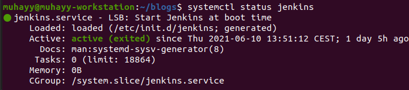
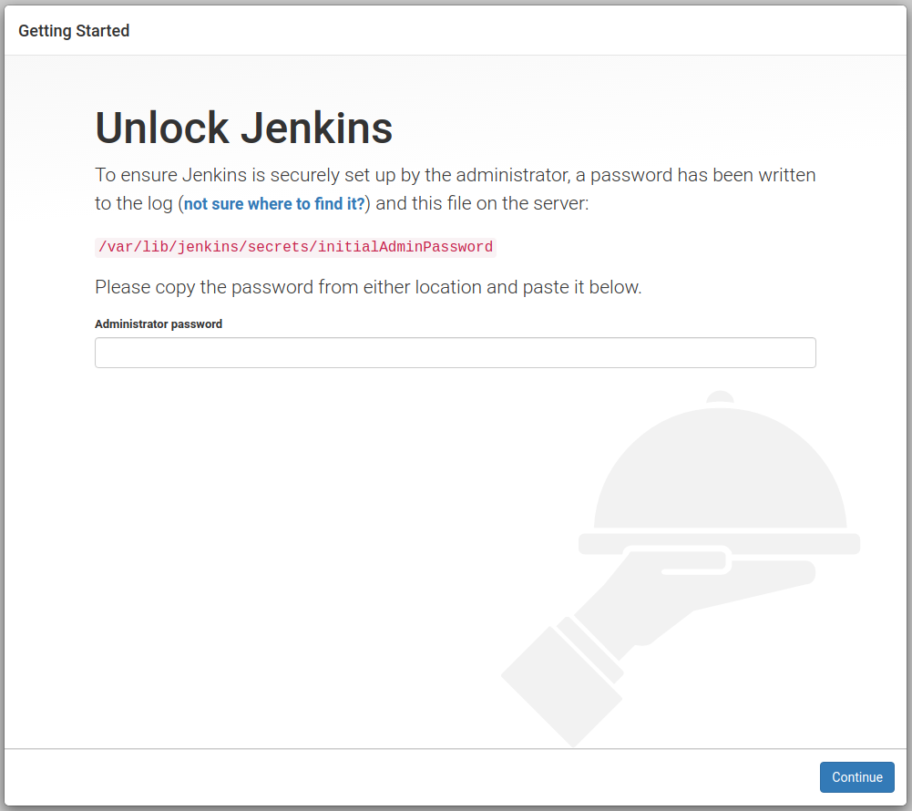
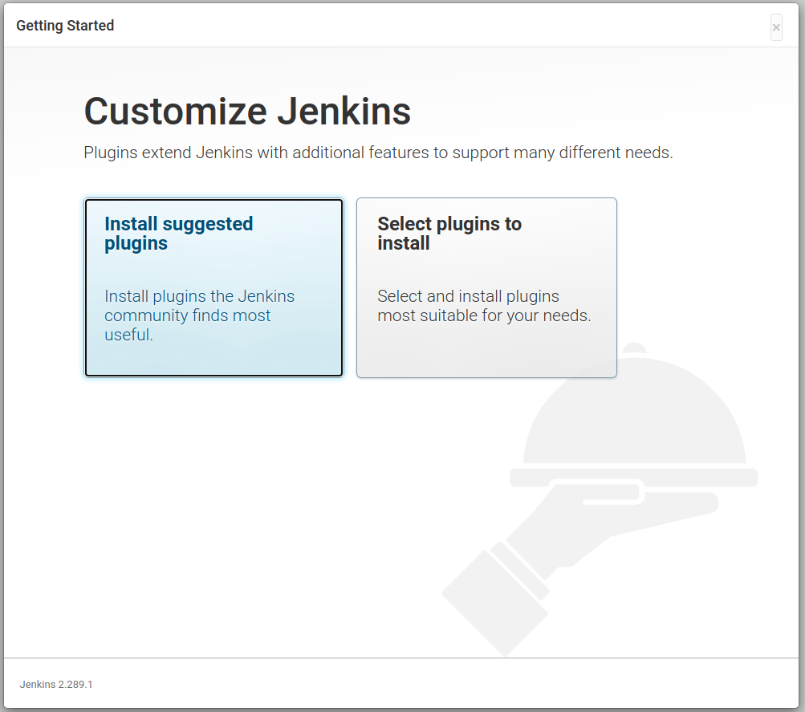
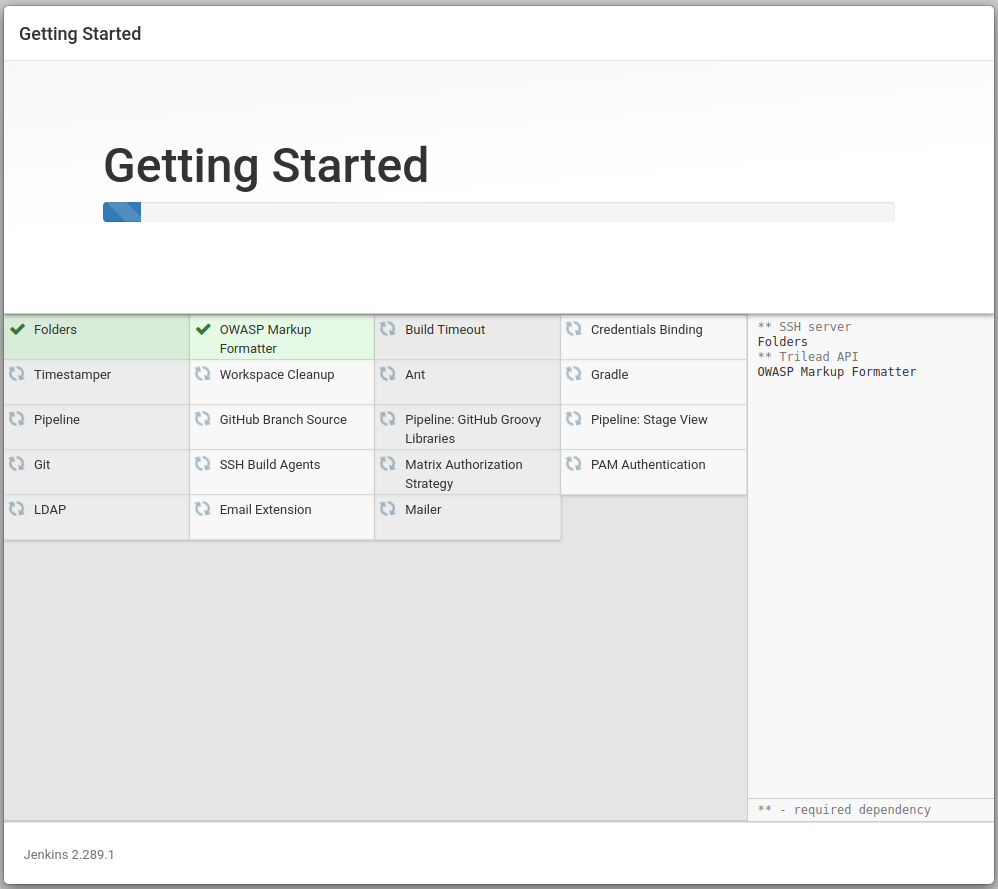
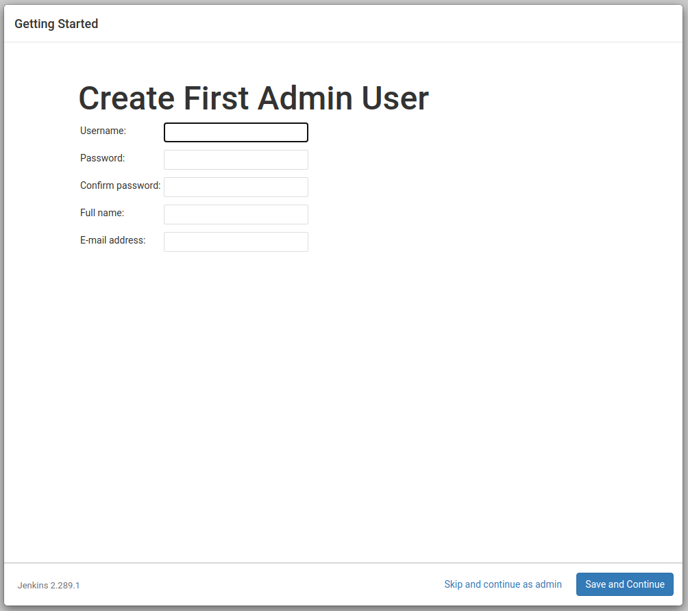
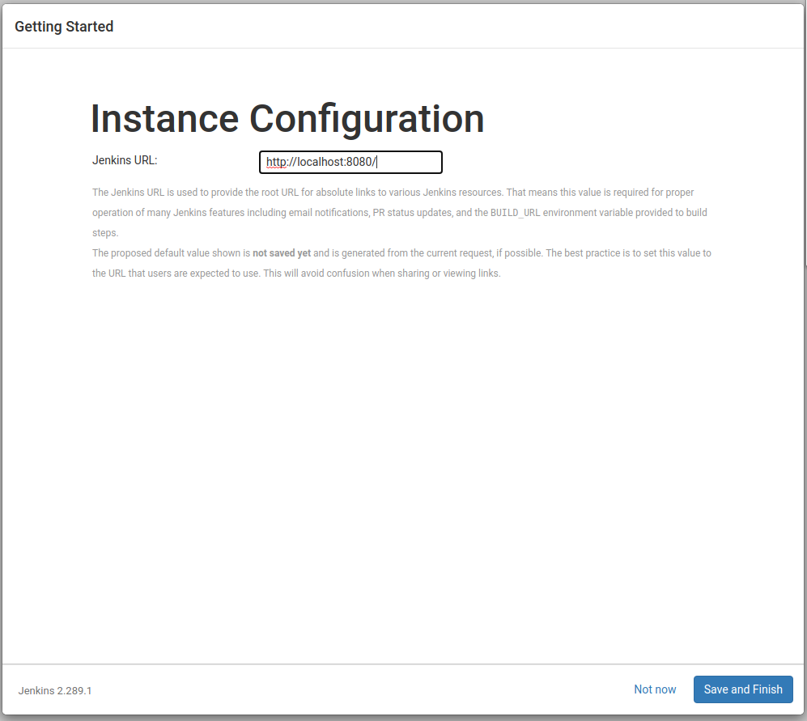
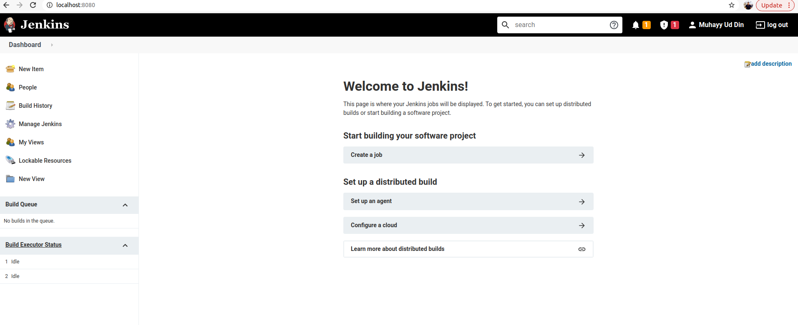

# Installing and setting up Jenkins

This article will explain how to install and configure Jenkins on Ubuntu 20.04. We will not go into the theoretical details like what is Jenkins? We all know Jenkins is an open source tool for continuous integration and continues delivery. It allows develope the pipeline that automatically build, test, and deploy  software applications.   

# Dependencies

One of the main dependency for installing Jenkine is Java, it required Java 8 or later. We can install openJDK, it is an open source implementation of Java.

```
sudo apt install openjdk-11-jdk
```
an implementation could be varified by typing 
```
java -version
```
# Installation

Type the following commands in terminal, These commands will add the jenkins package repository keys, append the package repository into the source.list and update apt.
```
wget -q -O - https://pkg.jenkins.io/debian-stable/jenkins.io.key | sudo apt-key add -
sudo sh -c 'echo deb http://pkg.jenkins.io/debian-stable binary/ > /etc/apt/sources.list.d/jenkins.list'
sudo apt update

```
After that Jenkins and its dependencies can be installed using the following command

```
sudo apt install jenkins
```
After installation the jenkins will start automatically. We can verify by typing the following command. 

```
systemctl status jenkins
```
It should show the output as shown below. 




If there is any firewall issue, we will open the port 8080 with ufw using the following command. In terminal type 

```
sudo ufw allow 8080
```

# Setting up Jenkins

Now the Jenkins could be launch in the web browser on the 8080 port, open web browser and type.

```
http://localhost:8080
```
The following screen will be displayed



initial administrator password can be obtained using the following command

```
sudo cat /var/lib/jenkins/secrets/initialAdminPassword
```
you will see a key like this 

```
d020523a30e9c862b8a62521f1ffdde1256fbfd27ce7a710b400a4a7377acfbc
```
Copy the password and paste in the administrator password textbox and click continue. 

The next screen will be appear as shown below



Click on the ***install suggested plugins***

A screen will appear as shown below. The Jenkins will automatically install the plugins



Once the plugins will be install, it will prompt to create first admin user, as shown below



Fill the details and press save and continue. A new screen will be appear that will show the Jenkins URL as shown below, change the URL if you want and click on save and finish.



once you finish, you will see the screen like this:



Congratulations! you have setup jenkins correctly and ready to create the first build job.
