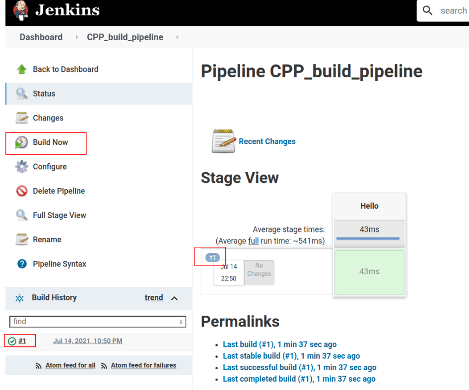
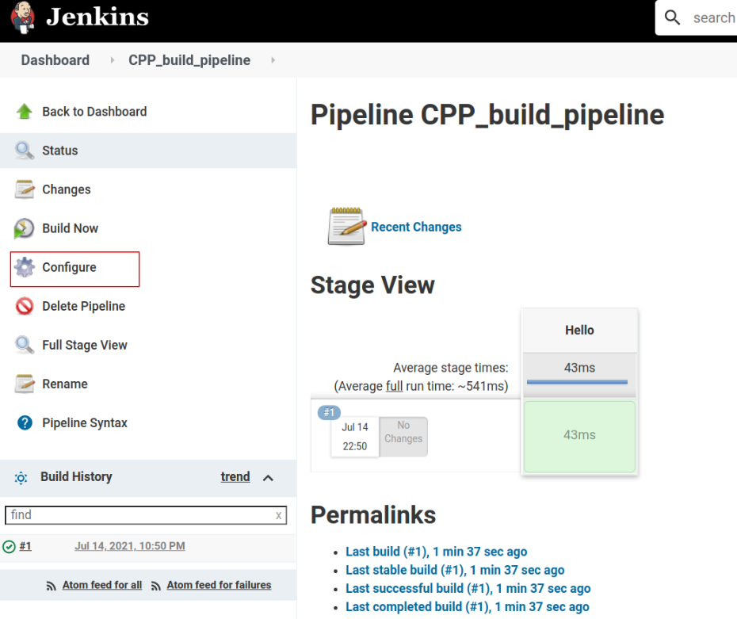
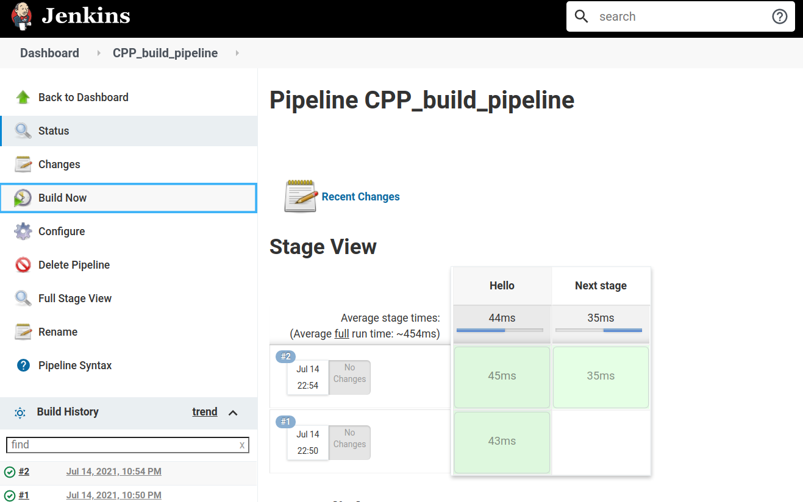

# Creating a jenkins build job with pipeline script

A jenkins build job represents a particular task in the build process. For instance a build job can consists of building the source code, running bug finder analysis over the code, generate the reports or deploy the application over the web. In this article will cover the following topics;

1. How to create a jenkins build job?
2. How to write pipeline script
3. How to clone repository with pipeline script
4. How to build C++ code with Pipeline script and archive the executables.  
   

# Jenkins build job with pipeline script

Pipelines are used to create the workflow within the jenkins build. To create a build job click on new item in the left menu as shown in the image below.


Select an appropriate name for the build job, We named our build job as *Cpp_build_pipeline*. We will select build job type as Pipeline and press Ok. 


Type any appropriate description for the build job. Although it is optional but it is nice to have the description. Select on the pipeline tab as shown below. 


Select the Hello World script from the top right corner under script block. Once we will click on the Hello World A script will appear  as shown in the image below. The script will be explained later. click on the save button.


The next page will appear as shown below, to build the newly created job, click on the build now under the left menu. We can see the stage view, the green color mean the stage is build successfully and the red color represents that an error occurs while building the stage. We can see the log by clicking on the build number highlighted with red box in the image below.  


By clicking on the build number the new page will be appear. Click on the console output, the log or the build will be appear as shown below. We can see the stage hello and the message Hello World in the log. 


Before moving further lets understand the script above The entire syntax of the pipeline script. The complete pipeline must always be within pipeline tag.

``` groovy
pipeline {
    ...
    stages{
    ...
    }
}

```

**agent any**: Agent is basically represents where the pipeline will be build, by default we will use *"agent any"*, it will run the pipeline on **Node**

a stage will be defile within the stages tag and all the description of the stage will be written with the steps tag. 

```groovy
  stages {
      stage('name'){
          steps {
              description
            }
      }
      stage('name'){
          steps {
              description
            }
      }
  }

```

Lets add another stage in the *Cpp_build_pipeline* script with the name "Next stage". This stage will also just print a simple message as given below. 

``` groovy
pipeline {
    agent any

    stages {
        stage('Hello') {
            steps {
                echo 'Hello World'
            }
        }

        stage('Next stage') {
            steps {
                echo 'This is a test stage'
            }
        }
    }
}

```

To copy the above script in the *Cpp_build_pipeline* job click on the configure under the left menu as shown below. a new page will appear click on the pipeline tab and replace the existing script with the above script and click on the save button.  


Click on the *build now* to build the job again, we can see now two stages under the stage view. 


The log will also show the info related the newly added stage shown in the image below.


Now we have the basic idea of creating a build job and pipeline script. Let take a step further and create a build job with  a bit meaningful pipeline script.

## Pipeline script to checkout Git repository  

The script below is the most basic version to clone a git repository repository.

```groovy
        stage('Checkout') {
            steps {
                checkout([$class: 'GitSCM', branches: [[name: '*/main']], 
                userRemoteConfigs: [[credentialsId: 'Github-key', url: 'https://github.com/Muhayyuddin/makefile_examples.git']]])                
            }
        }
```
The argument to *checkout* is representing that checkout belongs to GitSCM (that is Git Source Code Management), the name of the branch to clone is *main*, use *Github-key* credentialsId to clone the *https://github.com/Muhayyuddin/makefile_examples.git* url. This is the most basic checkout script.

The credentialsId is only required if the git repository is private or required password to clone. In case of public repository, we can skip the credentialsId, the simplified script is shown below.

```groovy
        stage('Checkout') {
            steps {
                checkout([$class: 'GitSCM', branches: [[name: '*/main']], 
                userRemoteConfigs: [[url: 'https://github.com/Muhayyuddin/makefile_examples.git']]])                
            }
        }
```
If the repository required the credentialsId, we need to add the credentials.  
## Adding credentials 
To add credentials click on Manage Jenkins.


Under system configuration click on Manage credentials.


Click on globals, this will add the credentials under the global scope.


Click on Add Credentials 


Add the details, in this case we are adding the username for the Github, similarly we can add for Bitbucket, GitLab or for others. The ID will be use to identify the credentials. After adding the details click on the save button. 


You should be able to see the credentials as shown below. *Github-key* will be used as *credentialsId* to use the added credentials


## Jenkins job to build multiple C++ projects and archive the executables 

We will write the pipeline script that will clone a git repository containing C++ code, build the code and archive the executable file. The code of the repository is explained in [makefile article](https://muhayyuddin.github.io/blogs/posts/ProgrammingTipsTrick/post1_How_to_create_makefile.html). We will use  *Cpp_build_pipeline* (that is created before) job and modify the script. 

The cloned repository contains three C++ examples, the repository structure of the examples is given below.


Lets build "makefile_example1" in the pipeline script. The stage to build code and archive the source file is given below.

```groovy
stage('build makefile_example1') {
      steps {
             sh '''

             cd makefile_example1
             pwd && ls -a
             make 
            ./output

            '''
            archiveArtifacts 'makefile_example1/output'
            }   
    }   
```
We can write the standard shell commands within 

```groovy
    sh '''

    '''

```
One line of shell script can be written sh ' ... ' or sh ('...'). archiveArtifact will be used to archive the executable or any other file. The complete script is given below.

``` groovy
pipeline {
    agent any

    stages {
        stage('Checkout') {
           steps {
                checkout([$class: 'GitSCM', branches: [[name: '*/main']], 
                userRemoteConfigs: [[url: 'https://github.com/Muhayyuddin/makefile_examples.git']]])                
                sh "ls -lart ./*"
            }
                
        }
    
        stage('build makefile_example1') {
            steps {
                sh '''
                cd makefile_example1
                pwd && ls -a
                make 
                ./output

                '''
                archiveArtifacts 'makefile_example1/output'

            }
        }
    }
}

```

Replace the Hello world script in the *Cpp_build_pipeline* job with the above script. 

Since the cloned repository contains three sample projects, We can extend the script to build all three example projects and archive executables. we will add three more stages into the pipeline script to build makefile_example2, generic_makefile_example, and to archive the executables in the final stage. the complete script is given below. 

```groovy
pipeline {
    agent any

    stages {
        stage('Checkout') {
           steps {
                checkout([$class: 'GitSCM', branches: [[name: '*/main']], 
                userRemoteConfigs: [[credentialsId: 'Github-key', url: 'https://github.com/Muhayyuddin/makefile_examples.git']]])                
                sh "ls -lart ./*"
            }
                
        }
    
        stage('build makefile_example1') {
            steps {
                sh '''
                cd makefile_example1
                pwd && ls -a
                make 
                ./output

                '''
                archiveArtifacts 'makefile_example1/output'

            }
        }

        stage('build makefile_example2') {
            steps {
                sh '''
                cd makefile_example2
                pwd && ls -a
                make 
                ./output

                '''
            }
        }

        stage('generic_makefile_example2') {
            steps {
                sh '''
                cd generic_makefile_example
                pwd && ls -a
                make 

                '''
            }
        }
        stage('archive_executables') {
            steps {
                
                archiveArtifacts 'makefile_example1/output'
                archiveArtifacts 'makefile_example2/output'
                archiveArtifacts 'generic_makefile_example/build/output'
            }
        }
    }
}

```

Replace the script in the *Cpp_build_pipeline* job with the above mentioned script and build the job. The output will be as shown below. The executable are shown under last successful artifact. 


The pipeline script can also be store inside the git repository. In fact the most appropriate way is to store the script inside the git repository. We will discuss this in our next topic 
