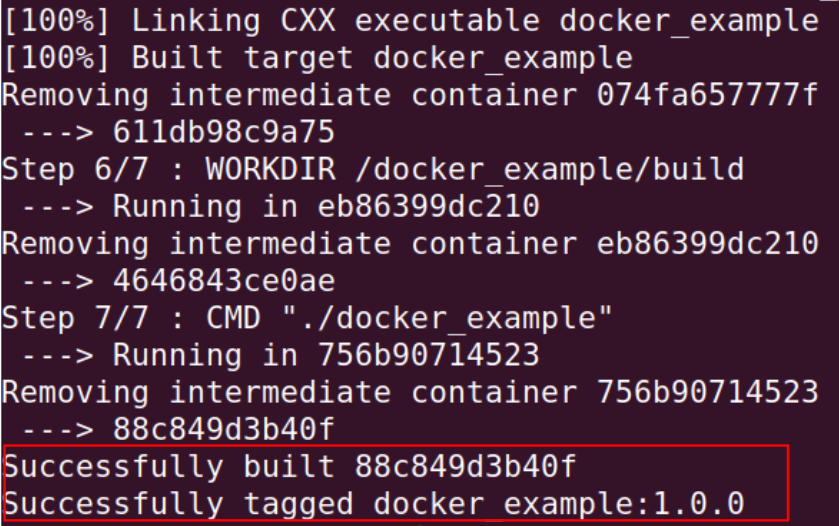
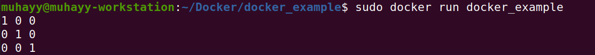
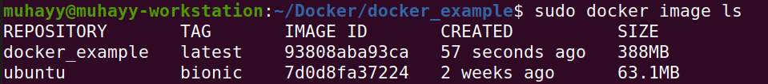

# Docker for beginners 

In this article we will understand a basic overview of docker, docker image, and docker containers. It will also provides the step by step instructions for;

1. Create docker image, build and run it in a container.
2. Push the docker image to docker hub.

## What is docker 

Docker is a framework to build, run, and ship applications in a way that it run in a consistent way on the other machines. 

## What is docker image
Docker image contains the instructions and dependencies to build and run the program in an isolated environment.

## What is docker container
Docker container is a virtual runtime environment, used to build run and deploy the applications independent from the underlying hardware and operation system.  It can also be considered as a runnable instance of docker image. 
# Example C++ Program
Lets suppose we have a simple C++ program that use Eigen library. The program display an identity rotation matrix on the console using eigen. The code for this program is given below.

``` cpp
#include <iostream>
#include <eigen3/Eigen/Core>
#include <eigen3/Eigen/Dense>

int main()
{
    Eigen::Matrix3d Rotation; 
    Rotation.setIdentity();
    std::cout<<Rotation<<std::endl;
    return 0;
}
```
The CMake file to compile the above stated code is given below. The cmake will find the eigne library, build the code and link the eigen library with the executable.

``` cmake
cmake_minimum_required(VERSION 2.8)
project(docker_example) 
add_compile_options(-std=c++11) 
find_package(Eigen3 REQUIRED)
link_directories(${Eigen_INCLUDE_DIRS})
add_executable(${PROJECT_NAME} "src/main.cpp") 
target_link_libraries(${PROJECT_NAME}  ${Eigen_LIBRARIES} )
```

## Docker image for the above C++ example
To compile this program, there are three main dependencies that are;
1. ubuntu
2. CMake 
3. Eigen library

We will write the docker image that will use the required operation system as base image. It will install all the required dependencies, Copy the code, build it and finally run the executable. 

The docker image is given below. 

``` docker
1. FROM ubuntu:bionic

2. RUN apt-get -y update && \
    apt-get install -y      \
    libeigen3-dev           \
    cmake

3. COPY . /docker_example

4. WORKDIR /docker_example

5. RUN pwd && ls -la;       \
    mkdir build;            \
    cd build;               \
    cmake ..;               \
    make; 

6. WORKDIR /docker_example/build

7. CMD "./docker_example"

```

- Line 1 of the docker image describes that the *ubuntu:bionic* will be used as base image to build the docker container. 
- Line 2 describes the dependencies that will be install in the container
- Line 3 will create an application directory in the container and copy the code into that directory. Since the code is located into the same folder in which Docker image is located, thats why the **.** will be used. 
- Line 4 will set application directory as the current directory.
- Line 5 will compile the code withing the build directory
- Line 6 Since the executable is located in the build directory, this directory will be set as working directory.
- Line 7 will run the executable to display the output on the console.

The code along with the Docker file can be downloaded at [https://github.com/Muhayyuddin/makefile_examples](https://github.com/Muhayyuddin/makefile_examples)

The command to build the docker image is given below. The *-t* represents the tag in this case it is *1.0.0* . The **.** at the end represents that the docker file is in the current directory.

```
sudo docker build -t docker_example:1.0.0 .
```



For the successful build, the execution should be completed with the message as described in the above image in the red box.

To run the docker container, the command is given below. 
```
sudo docker run docker_example
```
The identity rotation matrix will be displayed.




The command to see the list of installed containers is 
```
sudo docker image ls
```
In this case there will be two containers in the list, the docker_example and its base container that is ubuntu. 


## Pushing docker image to the DockerHub

In order to push the new image to the DockerHub, first of all the local repository will be tagged with the remote repository as shown below. 
```
sudo docker tag docker_example:1.0.0 muhayyuddin/docker_example:1.0.0
```
Then the following command will be used to login on DockerHub.
```
docker login -u "myusername" -p "mypassword" docker.io
```
Then the image can be pushed to the DockerHub as below.
```
sudo docker push muhayyuddin/docker_example:1.0.0
```
The docker image can be pulled and run on the local machine from the DockerHub using the following command

```
sudo docker run  muhayyuddin/docker_example:1.0.0
```
## Important Docker commands 

<table style="border: 1px  black; ">

<tr style="border: 1px solid black; ">
<td style="border: 1px solid black; "> 

### Commands
</td>
<td style="border: 1px solid black; "> 

### Description
</td>
</tr>

<tr style="border: 1px solid black;">
<td style="border: 1px solid black; "> 

```  
docker build -t docker_image:1.0 .
```
</td>
<td style="border: 1px solid black;" >

``` 
Build the docker image in the current directory and tag it

```
</td>
</tr>

<tr style="border: 1px solid black;">
<td style="border: 1px solid black; "> 

```  
docker image ls

```
</td>
<td style="border: 1px solid black;" >

``` 
To show all the images that are locally stored.

```
</td>
</tr>

<tr style="border: 1px solid black;">
<td style="border: 1px solid black; "> 

```  
docker image rm docker_image:1.0.0

```
</td>
<td style="border: 1px solid black;" >

``` 
To remove the locally stored image.
```
</td>
</tr>

<tr style="border: 1px solid black;">
<td style="border: 1px solid black; "> 

```  
docker pull myimage:1.0 
```
</td>
<td style="border: 1px solid black;" >

``` 
To pull the image from the remote repository. 

```
</td>
</tr>

<tr style="border: 1px solid black;">
<td style="border: 1px solid black; "> 

```  

docker tag docker_image:1.0 remote_repo/
docker_new_image:2.0

```
</td>
<td style="border: 1px solid black;" >

``` 
To rename the image and tag
```
</td>
</tr>

<tr style="border: 1px solid black;">
<td style="border: 1px solid black; "> 

```  
docker push remote_repo/docker_image:1.0.0

```
</td>
<td style="border: 1px solid black;" >

``` 
To push the image to the remote registry e.g. DockerHub

```
</td>
</tr>

<tr style="border: 1px solid black;">
<td style="border: 1px solid black; "> 

```  
docker pull remote_repo/docker_image:1.0.0

```
</td>
<td style="border: 1px solid black;" >

``` 
To pull the image from remote repository.

```
</td>
</tr>

<tr style="border: 1px solid black;">
<td style="border: 1px solid black; "> 

```  
docker run remote_repo/docker_image:1.0.0

```
</td>
<td style="border: 1px solid black;" >

``` 
To run the docker image.

```
</td>
</tr>

<tr style="border: 1px solid black;">
<td style="border: 1px solid black; "> 

```  
docker system prune -a

```
</td>
<td style="border: 1px solid black;" >

``` 
To remove all the images and containers.
```
</td>
</tr>

<tr style="border: 1px solid black;">
<td style="border: 1px solid black; "> 

```  
docker container ls 

```
</td>
<td style="border: 1px solid black;" >

``` 
To show the list of all the running containers. Adding the flag of  --all  will show all the stopped containers as well.

```
</td>
</tr>

<tr style="border: 1px solid black;">
<td style="border: 1px solid black; "> 

```  
docker container rm -f $(docker ps -aq) 

```
</td>
<td style="border: 1px solid black;" >

``` 
To remove all the running and stopped containers

```
</td>
</tr>

</table>
