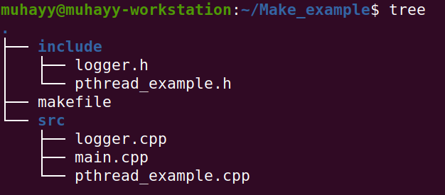
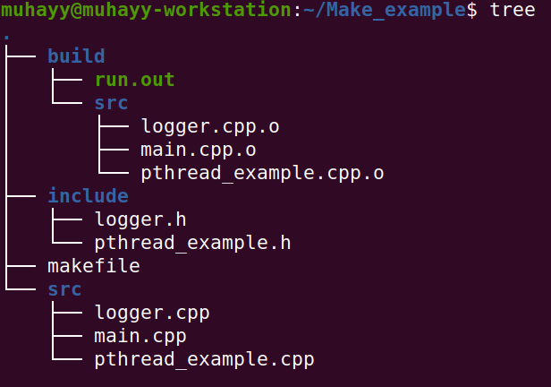

# How to build C++ code with Make

 

This tutorial will provide a very basic overview of makefile with practical examples. First we will discuss briefly some basic syntax and rules of makefile then we will try to understand makefile with the help of two basic examples that are;
1. Writing makefile for a hello world C++ program.
2. Writing makefile for a simple program that has external dependencies.

The code for the above program is available here [https://github.com/Muhayyuddin/makefile_examples](https://github.com/Muhayyuddin/makefile_examples).
## 1. Concept

Make is basically a build automation tool. It is mainly use generate executables and libraries form the source code. All the instructions to build the code are written in a file called *Makefile*. In this section we will try to understand the basic syntax/structure of the makefile. 

The syntax/structure of the makefile is given below

``` makefile
target: dependency 
    instruction to build the target
dependency: sub-dependency 
    instructions to build sub-dependency
...
...

```

In a general term the structure of the make file could be image as a dish. to prepare a dish we need to know its independents and the recipe. The recipe will explain how to use the indigents to prepare the dish. In this context the makefile will be write as below.

``` makefile
dish: ingredients
    recipe
```
## 2. A simple C++ example to understand Makefile

The example consists of a simple C++ program that has a *main.cpp* file, a *logger.cpp* and a *logger.h*. The *logger* contains a message, *main.cpp* will call logger to print the message the code is given below. 


<table style="border: 1px  black; ">

<tr style="border: 1px solid black; ">
<td style="border: 1px solid black; "> 

#### main.cpp
</td>
<td style="border: 1px solid black; "> 

#### logger.cpp
</td>
<td style="border: 1px solid black;"> 

#### logger.h
</td>
</tr>
<tr style="border: 1px solid black;">
<td style="border: 1px solid black; "> 

```  
#include"logger.h"
#include<cstdlib>
void main()
{
logger log;
log.message();
return 0;
}
```
</td>
<td style="border: 1px solid black;" >

  ``` 
#include <iostream>
#include "logger.h"
void logger::message()
{
std::cout<<"Hello, This is a makeFile example."<<std::endl;
}
```
</td>
<td style="border: 1px solid black;" >

 ``` 
#ifndef LOGGER_H
#define LOGGER_H
class logger {
public:
void message();
};
#endif//LOGGER_H

```
</td>
</tr>
</table>

Lets write the makefile for the above code. 


```
1. # 'generates output file (exe) from main.o and logger.o'
2. output: main.o logger.o  
3.    # 'defines how output file will be generated from main.o and logger.o'
4.    g++ main.o logger.o -o output
5. # 'generates main.o file from main,cpp'  
6. main.o: main.cpp  
7.    # 'defines how main.o file will be generated from main.cpp'
8.    g++ -c main.cpp  
9.  # 'generates logger.o from logger.cpp and logger.h'
10. logger.o: logger.cpp logger.h 
11.    # 'defines how the logger.o will be generated from logger.cpp'
12.    g++ -c logger.cpp 
13. # 'these two lines are describing that when clean will call, remove all object files and output file' 
14. clean:            
15.    rm *.o output
```
In the above code line 1. says make and executable file with the name **output** using *main.o* and *logger.o*. Line 4. defines the recipe how the output file will be created form main.o and logger.o. Line 6 and 10 are describing the dependencies for main.o and logger.o. Line 8 and 12 are describing how main.cpp and logger.cpp will be converted to main.o and logger.o respectively. Finally line 14 and 15 saying if clean is called, remove all files that have extensions .o also remove the output file.

Now, to run the make file open terminal, navigate to the code repository and type make as shown in figure below.
 
 

Notice that the compile instructions are in printed in the reverse order as compare to makefile the first line of the makefile is executed at the end because it depends on the logger and main, so these files will compile first. To clean the generated files we will type make clean as shown above.  

## 3. Makefile for a simple program that has external dependencies
In this section we will write a makefile for the program that has external dependency on pthread. The code for this simple C++ program is given below. 

``` 
#include <pthread.h>
#include <stdio.h>
#include <stdlib.h>
#define NUM_THREADS 5

void *message(void *threadid);

int main(int argc, char *argv[])
{
   pthread_t threads[NUM_THREADS];
   int rc;
   long t;
   for(t=0;t< NUM_THREADS;t++){
     printf("thread from main: creating thread %ld\n", t);
     rc = pthread_create(&threads[t], NULL, message, (void *)t);
     if (rc){
       printf("ERROR; return code from pthread_create() is %d\n", rc);
       exit(-1);
       }
     }
    pthread_exit(NULL); 
}

void *message(void *threadid)
{
   long tid;
   tid = (long)threadid;
   printf("Thread from message: creating thread #%ld!\n", tid);
   pthread_exit(NULL);
}
```

The makefile for above code will be like this;

``` 
1. output: main.o
2.	gcc main.o -lpthread -o output
3. main.o: main.cpp
4.	gcc -c main.cpp 
5. clean:
6.	rm *.o output
```
Notice *-lpthread*  in line 2 this is basically the flag to link the pthread library. In the similar way we can link as many library as we have in our program.  

## Generic Makefile for C++

The makefile examples that are described above are good for very small programs. However, for large programs it is very time consuming task to type the names of all the c++ and heads in the makefile. if we change the name of the C++ file or add some more files we have to adapt out makefile accordingly. In this section we will try to write a generic makefile for large C++ projects. The code is available on the github under the this link [https://github.com/Muhayyuddin/makefile_examples](https://github.com/Muhayyuddin/makefile_examples).

Lets merge the two above explained examples in a single C++ project and split the code into directories. A typical structure of the C++ project is consists of a include directory containing all the head files, a src directory containing all the cpp files and a makefile in the root folder as shown below



Our generic *makefile* will pick all the files form include and src directories that have *.h* and *.cpp*/*.C* extensions respectively. Then it will create a build directory that will contains all the generated object files and executable. The generic make file is shown below.

```
# 'specify that the the name of the final executable will be run.out'
TARGET ?= run.out
# 'assigning name to the project directories'
BUILD_DIR ?= ./build
SRC_DIRS ?= ./src
INCLUDE_DIRS ?= ./include
# 'setting up the variables'
SRCS := $(shell find $(SRC_DIRS) -name *.cpp -or -name *.c)
OBJS := $(SRCS:%=$(BUILD_DIR)/%.o)
DEPS := $(OBJS:.o=.d)

INC_DIRS := $(shell find $(INCLUDE_DIRS) -type d)
INC_FLAGS := $(addprefix -I,$(INC_DIRS))

CPPFLAGS ?= $(INC_FLAGS) 
# 'building target'
$(BUILD_DIR)/$(TARGET): $(OBJS)
	g++ $(OBJS) -o $@  -lpthread 
# 'creating build folder and compiling cpp to obj files'
$(BUILD_DIR)/%.cpp.o: %.cpp 
	$(MKDIR_P) $(dir $@)
	g++ $(CPPFLAGS) $(CXXFLAGS) -c $< -o $@	
clean:
	$(RM) -r $(BUILD_DIR)
MKDIR_P ?= mkdir -p

```
The makefile is pretty much self explanatory. The details of the environment variables and regular expressions will be discussed in the other post. 
Once the project is built it the root folder will contains a build folder containing all the object files and the executable as shown in figure below. 

