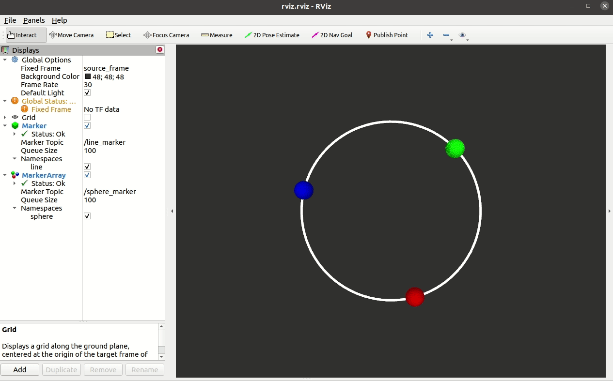

# ROS Publisher and Subscriber Nodes

This article will explain ROS publisher and subscriber nodes with the help of basic examples in C++ and Python. Software in ROS is organized in packages. ROS package contains, nodes, libraries, configuration files, datasets etc.  
## ROS Node
ROS node is an executable file within the ROS package. Nodes use a ROS client library to communicate with other nodes. Nodes can publish or subscribe to a Topic. Nodes can also provide or use a Service.
## Publisher and Subscriber Nodes
Publisher node provide the information for other nodes by publishing the information to a particular topic. For instance, camera node will continually publishing the images, joint state publisher node will keep publishing the current joints positions of the robot. 

The information in ROS is called a topic. A topic defines the types of messages that will be sent concerning that topic. The subscriber node receives the information by subscribing to the particular topic.

We will understand the ROS publisher subscriber with the help of simple examples. The examples are intentionally kept very simple because the objective of this article is to understand how can we establish communication between two nodes using publisher subscriber. 
### C++ example

The example below is explaining a simple C++ based publisher and subscriber. The publisher is publishing string messages *"simple message"*. The subscriber subscribe to the publisher and receive and print the published string messages.
<table> <tr > <td > 

#### Publisher 
</td> <td > 

#### Subscriber
</td></tr>
<tr > <td > 

```

#include "ros/ros.h"
#include "std_msgs/String.h"

int main(int argc, char **argv)
{
  //'Initialize the rosnode with the name simple_publisher.'
  ros::init(argc, argv, "simple_publisher");
  
  //'NodeHandle is the main access point to communications with the ROS system.'
  ros::NodeHandle n;

  //create a publisher with the name simple_publisher that will publish 
  //the messages of type string and buffered 100 messages.
  ros::Publisher publisher = n.advertise<std_msgs::String>("sender", 100);
  
  //specifying the frequency of publishing the message.
  ros::Rate loop_rate(10);

  while (ros::ok())
  {
    
    //create a string message to publish
    std_msgs::String msg;
    msg.data = "simple message ";
    
    //print the message (that will be published). 
    ROS_INFO("%s", msg.data.c_str());

    //publish the string message.
    publisher.publish(msg);

    ros::spinOnce();

    loop_rate.sleep();
  }

  return 0;
}


```
</td> <td >

```
#include "ros/ros.h"
#include "std_msgs/String.h"

//callback function to receive the messages from the topic
void subscriberCallback(const std_msgs::String::ConstPtr &msg)
{
  ROS_INFO("I received: [%s]", msg->data.c_str());
}

int main(int argc, char **argv)
{
  
  //Initialize the rosnode with the name simple_publisher.
  ros::init(argc, argv, "simple_subscriber");

  //NodeHandle is the main access point to communications with the ROS system.
  ros::NodeHandle n;

  //subscribe to the simple_publisher. The second parameter to the subscribe() function is 
  //the size of the message queue.  If messages are arriving faster than they are being 
  //processed, this is the number of messages that will be buffered up before beginning to throw.
  ros::Subscriber subscriber = n.subscribe("/simple_publisher", 100, subscriberCallback);
  
  //ros::spin() will enter a loop, pumping callbacks.
  ros::spin();

  return 0;
}

```
</td> </tr> </table>
The complete package of the above code along with CMake and Package.xml can be found in the following GitHub repository. 

### Python example
The python version of above explained simple publisher subscriber is given below. The code is pretty much self explanatory, the functionality of both (c++ and python) will be the same.

<table> <tr > <td > 

#### Publisher
</td> <td > 

#### Subscriber
</td></tr>
<tr > <td > 

```

#!/usr/bin/env python
# importing rospy and string from std_msgs
import rospy
from std_msgs.msg import String

#defining a publisher that will publish hello world string along with time. 
def publisher():
    
    #create a publisher with the name simple_publisher that will publish 
    #the messages of type string and buffered 10 messages.
    pub = rospy.Publisher('simple_publisher', String, queue_size=10)
    
    #initialize a topic(rosnode) with the name talker
    rospy.init_node('sender', anonymous=True)
    
    #specifying the frequency of publishing the message.
    rate = rospy.Rate(10) # 10hz
    
    while not rospy.is_shutdown():
        #create a string message to publish
        message_str = "simple message %s" % rospy.get_time()
        #print the message (that will be published). 
        rospy.loginfo(message_str)
        #publish the string message.
        pub.publish(message_str)
        #call ros rate sleep.
        rate.sleep()
#main function
if __name__ == '__main__':
    try:
        #start publisher
        publisher()
    except rospy.ROSInterruptException:
        pass

```
</td> <td >

```
#!/usr/bin/env python
# importing rospy and string from std_msgs
import rospy
from std_msgs.msg import String
 
def callback(data):
    rospy.loginfo(rospy.get_caller_id() + "I heard %s", data.data)
     
def receiver():
    
    #initialize ros node with the name receiver.
    # The anonymous=True flag means that rospy will choose a unique
    # name for our 'receiver' node so that multiple receiver can
    # run simultaneously.
    rospy.init_node('receiver', anonymous=True)

    #subscribe to simple publisher node.
    rospy.Subscriber("/simple_publisher", String, callback)
 
    # spin() simply keeps python from exiting until this node is stopped
    rospy.spin()
 
if __name__ == '__main__':
    receiver()

```
</td> </tr> </table>

# Publisher with Rviz
Lets discuss another simple example of publisher. In this example the C++ based publisher is publishing the RViz marker. RViz is a visualization tool for ROS. We are using 2 types of markers, sphere and line. 
the positions of the spheres and the line is computed using the parametric equation of circle. [ $x = r \cos(\theta)$, $x = r \sin(\theta)$ ]. We will keep publishing the markers with their new $(x,y)$ positions and we will visualize the markers using RViz as shown in the image below.




```
#include <ros/ros.h>
#include <visualization_msgs/Marker.h>
#include <visualization_msgs/MarkerArray.h>
#include <unistd.h>


int main(int argc, char **argv)
{
    ros::init(argc, argv, "marker_visualizer");
    ros::NodeHandle n;
    //loading the mesh path for sphere.
    std::string path_to_models = "package://publisher_rviz/model/sphere.stl";
    //creating marker publishers for line and spheres
    ros::Publisher sphere_publisher = n.advertise<visualization_msgs::MarkerArray>("sphere_marker", 1);
    ros::Publisher line_publisher = n.advertise<visualization_msgs::Marker>("line_marker", 1);


    std::vector<double> pose;
    std::vector<double> color;
    std::vector<geometry_msgs::Point> line_points;

    ros::Rate r(10);
    //computing the points for line.
    for (uint32_t i = 0; i < 110; ++i)
    {
        geometry_msgs::Point p;
        float x = 2 * sin(i / 100.0f * 2 * M_PI);
        float y = 2 * cos(i / 100.0f * 2 * M_PI);
        p.x = x;
        p.y = y;
        p.z = 1.0;
        line_points.push_back(p);
    }

    while (ros::ok())
    {
        //Computing the the positions of the spheres.
        for (uint32_t i = 0; i < 100; ++i)
        {
            visualization_msgs::MarkerArray spheres;
            visualization_msgs::Marker line;

            float x = 2 * sin(i / 100.0f * 2 * M_PI);
            float y = 2 * cos(i / 100.0f * 2 * M_PI);
            pose = {x, y, 1.0, 0.0, 0.0, 0.0, 1.0};
            color = {0.0, 1.0, 0.0, 1.0};
            spheres.markers.push_back(createSphere(path_to_models, 1, "source_frame", pose, color));

            x = 2 * sin((i + 33) / 100.0f * 2 * M_PI);
            y = 2 * cos((i + 33) / 100.0f * 2 * M_PI);
            pose = {x, y, 1.0, 0.0, 0.0, 0.0, 1.0};
            color = {1.0, 0.0, 0.0, 1.0};
            spheres.markers.push_back(createSphere(path_to_models, 2, "source_frame", pose, color));

            x = 2 * sin((i + 66) / 100.0f * 2 * M_PI);
            y = 2 * cos((i + 66) / 100.0f * 2 * M_PI);
            pose = {x, y, 1.0, 0.0, 0.0, 0.0, 1.0};
            color = {0.0, 0.0, 1.0, 1.0};
            spheres.markers.push_back(createSphere(path_to_models, 3, "source_frame", pose, color));

            color = {1.0, 1.0, 1.0, 1.0};
            line = createLine(1, "source_frame", line_points, color);

            //publishing the line and sphere markers.
            line_publisher.publish(line);
            sphere_publisher.publish(spheres);
            r.sleep();
        }
    }
}
```
</td> </tr> </table>


Below is the code related to creating the line sphere and line markers, basically we are just filling the data structures of the markers. 

The  frame_id is the RViz fixed frame, everything in the code below is self explanatory.
<table> <tr > <td > 


#### Creating Sphere Marker for RViz
</td> <td > 

#### Creating Line Marker for RViz
</td></tr>
<tr > <td > 

```

visualization_msgs::Marker createSphere(std::string path_to_model, 
    unsigned int id, std::string frame_id,
    std::vector<double> pose, std::vector<double> color)
{
    visualization_msgs::Marker marker;

    marker.header.frame_id = frame_id;
    marker.header.stamp = ros::Time();
    marker.ns = "sphere";
    marker.id = id;
    marker.mesh_resource = path_to_model;

    marker.type = visualization_msgs::Marker::MESH_RESOURCE;
    marker.action = visualization_msgs::Marker::ADD;

    marker.pose.position.x = pose[0];
    marker.pose.position.y = pose[1];
    marker.pose.position.z = pose[2];
    marker.pose.orientation.x = pose[3];
    marker.pose.orientation.y = pose[4];
    marker.pose.orientation.z = pose[5];
    marker.pose.orientation.w = pose[6];
    marker.scale.x = 0.01;
    marker.scale.y = 0.01;
    marker.scale.z = 0.01;
    marker.color.a = color[3];
    marker.color.r = color[0];
    marker.color.g = color[1];
    marker.color.b = color[2];
    return marker;
}

```
</td> <td >

```
visualization_msgs::Marker createLine(unsigned int id, 
std::string frame_id, std::vector<geometry_msgs::Point> points, 
                    std::vector<double> color)
{
    visualization_msgs::Marker line;
    line.header.frame_id = frame_id;
    line.header.stamp = ros::Time::now();
    line.ns = "line";
    line.action = visualization_msgs::Marker::ADD;
    line.pose.orientation.w = 1.0;
    line.id = id;

    line.type = visualization_msgs::Marker::LINE_STRIP;

    line.scale.x = 0.05;
    line.color.r = color[0];
    line.color.g = color[1];
    line.color.b = color[2];
    line.color.a = color[3];

    for (auto &point : points)
    {
        geometry_msgs::Point p;
        p.x = point.x;
        p.y = point.y;
        p.z = 1;

        line.points.push_back(p);
    }

    return line;
}
```
</td> </tr> </table>

The code for the above example can be found in the git repository. The repository contains the complete package along with the RViz configurations. 

To run this example, run the following 3 commands in separate terminals. 

```
1. roscore
2. rosrun publisher_rviz publisher_rviz_node 
3. rviz
 
```
The third command will open the RViz, in RViz click on *File -> Open Configuration* , navigate to the location of the package  and select rviz.rviz file in the conf folder. 


